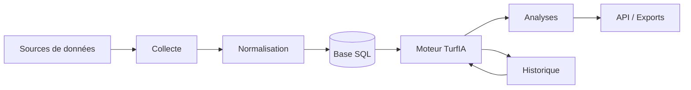

L003 — Architecture générale de TurfIA

## Objectif

Décrire l'architecture fonctionnelle et technique de TurfIA.

## Principes d'architecture

- Séparation stricte des responsabilités.
- Modularité.
- Traçabilité.
- Reproductibilité.
- Aucune donnée codée en dur.
- Évolution incrémentale.
- Automatisation.

## Vue d'ensemble

## Architecture fonctionnelle

### Modules
- Collecte
- Normalisation
- Analyse
- Historique
- API
- Automatisation

## Architecture technique

- Base de données SQL.
- API REST interne.
- Moteur de règles métier.
- Moteur de scoring TurfIA.
- Service d'automatisation des procédures quotidiennes.
- Journalisation et traçabilité des traitements.
- Interfaces d'export (JSON, CSV, PDF).